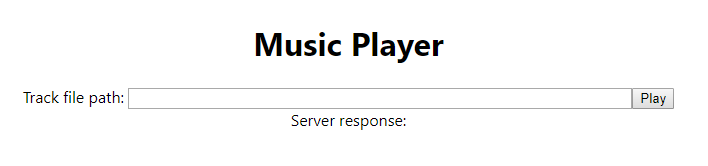

# Music player frontend

This is a create-react-app webapp that interacts with the music player server.

## Functionality

You can enter a file path and press play!

## Installation

Install node

`npm install` in this directory (actually I prefer `pnpm` which avoids creating a new local copy of every dependency in every project you install)

## Running

`npm start` to run in dev mode.

You might want to open at 127.0.0.1 rather than localhost to avoid random 300ms delays in requests to the server due to
some chrome bug

## Screenshot

